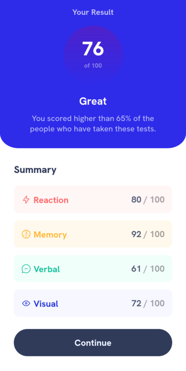

# Frontend Mentor - Results summary component solution

This is a solution to the [Results summary component challenge on Frontend Mentor](https://www.frontendmentor.io/challenges/results-summary-component-CE_K6s0maV). Frontend Mentor challenges help you improve your coding skills by building realistic projects. 

## Table of contents

- [Overview](#overview)
  - [Screenshot](#screenshot)
  - [Links](#links)
- [My process](#my-process)
  - [Built with](#built-with)
  - [What I learned](#what-i-learned)
  - [Continued development](#continued-development)
  - [Useful resources](#useful-resources)
- [Author](#author)

## Overview

Results summary component - This was one of my coolest projects ever. honestly, at first I thought it is a piece of cake.
but I was wrong. It took me hours to complete it and through it I learned lots of things.

### Screenshot

- Desktop View

- Mobile View

### Links

- [Solution URL](https://github.com/reza-sjdn/results-summary-component)
- [Live Demo](https://reza-sjdn.github.io/results-summary-component/)

## My process

### Built with

- Semantic HTML5 markup
- CSS custom properties
- Flexbox
- Mobile-first workflow

### What I learned

In fact I didn't learned any new thing, but reviewed past concepts.
Of course I read an article about mobile-first workflow and learned more
about chrome dev tools.

### Continued development

I'm gonna learn Sass and from now on I wanna incorperate this tool into Css.

### Useful resources

- [A Hands-On Guide to Mobile-First Responsive Design](https://www.uxpin.com/studio/blog/a-hands-on-guide-to-mobile-first-design/) - I studied mobile-first workflow from this website. I really liked this pattern and will use it going forward.

## Author

You could follow me on these platforms:

- Frontend Mentor - [@reza-sjdn](https://www.frontendmentor.io/profile/reza-sjdn)
- Twitter - [@reza_sjdn](https://www.twitter.com/reza_sjdn)
- Telegram - [@reza_sjdn80]
